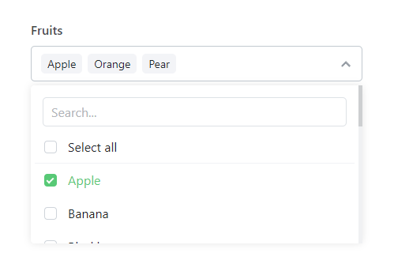

# Multi Select Dropdown JS

Create powerful user interfaces with our **Multi Select Dropdown**! This tool enhances native select elements, allowing for multiple selections, dynamic content generation, integrated search functionality, and customizable UI without any dependencies. No jQuery or other library is required!

The complete guide and reference is available here: [https://codeshack.io/multi-select-dropdown-html-javascript/](https://codeshack.io/multi-select-dropdown-html-javascript/)

Demo: [https://codeshack.io/multi-select-dropdown-js/](https://codeshack.io/multi-select-dropdown-js/) 

## Features
- **Multiple Selections**: Users can select more than one option in the dropdown.
- **Search Functionality**: Includes a built-in search to find options quickly.
- **Dynamic Content**: Options can be dynamically added to the dropdown.
- **Customizable UI**: Style the dropdown to match your site with minimal CSS.
- **Lightweight**: Lightweight in size and does not depend on other libraries.
- **Flexible**: Convert your existing native select elements with minimal configuration.

## Screenshot



## Quick Start
Clone the repository and include the CSS and JavaScript files in your project.

Add the following to the **head** tag:
```html
<link rel="stylesheet" href="path/to/multi-select-dropdown.css">
```
Append the following to the **body** tag:
```html
<script src="path/to/multi-select-dropdown.js"></script>
```

## Usage

Here's a simple example to add the multi-select dropdown to your project:

```html
<select id="example-multi-select" data-placeholder="Select options" multiple="multiple" data-multi-select>
    <option value="option1">Option 1</option>
    <option value="option2">Option 2</option>
    <!-- more options -->
</select>
```
Or:
```html
<select id="example-multi-select" data-placeholder="Select options" multiple="multiple">
    <option value="option1">Option 1</option>
    <option value="option2">Option 2</option>
    <!-- more options -->
</select>

<script src="path/to/multi-select-dropdown.js"></script>
<script>
    new MultiSelect(document.getElementById('example-multi-select'));
</script>
```

## Configuration

You can pass a settings object to customize the dropdown:

```javascript
new MultiSelect(document.getElementById('example-multi-select'), {
    placeholder: 'Select options',
    max: 5,  // Maximum number of items that can be selected
    search: true,  // Enable the search box
    selectAll: true,  // Add a select all option
    onChange: function(value, text, element) {
        console.log('Change:', value, text, element);
    },
    onSelect: function(value, text, element) {
        console.log('Selected:', value, text, element);
    },
    onUnselect: function(value, text, element) {
        console.log('Unselected:', value, text, element);
    }
});
```

Also, you can dynamically add the options:

```javascript
new MultiSelect(document.getElementById('example-multi-select'), {
    data: [
        {
            value: 'opt1',
            text: 'Option 1'
        },
        {
            value: 'opt2',
            html: '<strong>Option 2 with HTML!</strong>'
        },
        {
            value: 'opt3',
            text: 'Option 3',
            selected: true
        },
        {
            value: 'opt4',
            text: 'Option 4'
        },
        {
            value: 'opt5',
            text: 'Option 5'
        }
    ],
    placeholder: 'Select options',
    max: 5,  // Maximum number of items that can be selected
    search: true,  // Enable the search box
    selectAll: true,  // Add a select all option
    onChange: function(value, text, element) {
        console.log('Change:', value, text, element);
    },
    onSelect: function(value, text, element) {
        console.log('Selected:', value, text, element);
    },
    onUnselect: function(value, text, element) {
        console.log('Unselected:', value, text, element);
    }
});
```

## License

Distributed under the MIT License. See `LICENSE` for more information.

## Contact

David Adams - [info@codeshack.io](mailto:info@codeshack.io)

GitHub: [https://github.com/codeshackio/multi-select-dropdown-js](https://github.com/codeshackio/multi-select-dropdown-js)

X (Twitter): [https://twitter.com/codeshackio](https://twitter.com/codeshackio)

Feel free to open an issue or submit pull requests.
