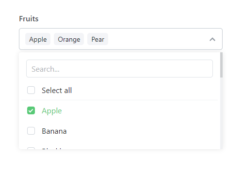

# Multi Select Dropdown JS

Create powerful user interfaces with our **Multi Select Dropdown**! This tool enhances native select elements, allowing for multiple selections, dynamic content generation, integrated search functionality, and customizable UI without any dependencies. No jQuery or other library is required!

The complete guide and reference is available here: [https://codeshack.io/multi-select-dropdown-html-javascript/](https://codeshack.io/multi-select-dropdown-html-javascript/)

Demo: [https://codeshack.io/multi-select-dropdown-js/](https://codeshack.io/multi-select-dropdown-js/) 

## Features
- **Multiple Selections**: Users can select more than one option in the dropdown.
- **OptGroups & Sublists**: Natively parses HTML `<optgroup>` tags and automatically generates master toggle switches for groups.
- **Native Form Validation**: Fully supports the HTML5 `required` attribute with perfectly positioned browser tooltips.
- **Dark Mode & Themes**: Built-in support for `auto` (follows OS preference), `light`, and `dark` themes.
- **Async Data Fetching**: Easily load external JSON arrays from APIs using the built-in `.fetch()` method.
- **Search Functionality**: Includes a built-in search to find options quickly.
- **Dynamic & Reactive**: Update options dynamically via JS setters. The UI instantly reacts to data changes.
- **Secure & Accessible**: Built-in XSS protection, memory-leak proof, framework-agnostic, and fully keyboard navigable.
- **Lightweight**: Lightweight in size and does not depend on other libraries.

## Screenshot



## Quick Start
Clone the repository and include the CSS and JavaScript files in your project.

Add the following to the **head** tag:
```html
<link rel="stylesheet" href="path/to/multi-select-dropdown.css">
```
Append the following to the **body** tag:
```html
<script src="path/to/multi-select-dropdown.js"></script>
```

## Usage

Here's a simple example to add the multi-select dropdown to your project. 

*(Tip: Always append `[]` to your `name` attribute if you are submitting data to a backend like PHP!)*

```html
<select id="example-multi-select" name="options[]" data-placeholder="Select options" multiple data-multi-select>
    <option value="option1">Option 1</option>
    <option value="option2">Option 2</option>
    <!-- more options -->
</select>
```
Or initialize it manually via JavaScript:
```html
<select id="example-multi-select" name="options[]" multiple>
    <option value="option1">Option 1</option>
    <option value="option2">Option 2</option>
    <!-- more options -->
</select>

<script src="path/to/multi-select-dropdown.js"></script>
<script>
    new MultiSelect(document.getElementById('example-multi-select'), {
        placeholder: 'Select options',
        theme: 'auto'
    });
</script>
```

## Configuration

You can pass a settings object to customize the dropdown behavior and styling:

```javascript
new MultiSelect('#example-multi-select', {
    placeholder: 'Select options',
    theme: 'auto', // 'auto', 'light', or 'dark'
    min: 1,  // Minimum number of items required
    max: 5,  // Maximum number of items that can be selected
    search: true,  // Enable the search box
    selectAll: true,  // Add a "Select All" toggle
    listAll: true, // If false, shows "X selected" instead of listing tags
    closeListOnItemSelect: false, // Auto-close the dropdown after selection
    required: true, // Enforce native HTML5 form validation
    
    onChange: function(value, text, element) {
        console.log('Change:', value, text, element);
    },
    onSelect: function(value, text, element) {
        console.log('Selected:', value, text, element);
    },
    onUnselect: function(value, text, element) {
        console.log('Unselected:', value, text, element);
    },
    onMaxReached: function(max) {
        console.log('Maximum selections reached:', max);
    }
});
```

### Dynamically Adding Options & Groups

You can dynamically populate the dropdown with grouped data, disabled options, and safe custom HTML injection:

```javascript
const mySelect = new MultiSelect('#example-multi-select', {
    data:[
        {
            value: 'opt1',
            text: 'Option 1',
            group: 'Basic Settings'
        },
        {
            value: 'opt2',
            html: '<strong style="color: red;">Option 2 with HTML!</strong>',
            group: 'Basic Settings'
        },
        {
            value: 'opt3',
            text: 'Option 3',
            selected: true,
            group: 'Advanced Settings'
        },
        {
            value: 'opt4',
            text: 'Locked Option',
            disabled: true // Prevents user interaction
        }
    ],
    placeholder: 'Select options',
    search: true,
    selectAll: true
});
```

### Asynchronous Data Fetching

Loading data from a remote endpoint is handled natively:

```javascript
const asyncSelect = new MultiSelect('#example-multi-select', {
    placeholder: 'Loading remote data...'
});

// Fetches a JSON array formatted like the data object above
asyncSelect.fetch('https://api.yoursite.com/endpoint');
```

## License

Distributed under the MIT License. See `LICENSE` for more information.

## Contact

David Adams - [info@codeshack.io](mailto:info@codeshack.io)

GitHub: [https://github.com/codeshackio/multi-select-dropdown-js](https://github.com/codeshackio/multi-select-dropdown-js)

X (Twitter): [https://twitter.com/codeshackio](https://twitter.com/codeshackio)

Feel free to open an issue or submit pull requests.
